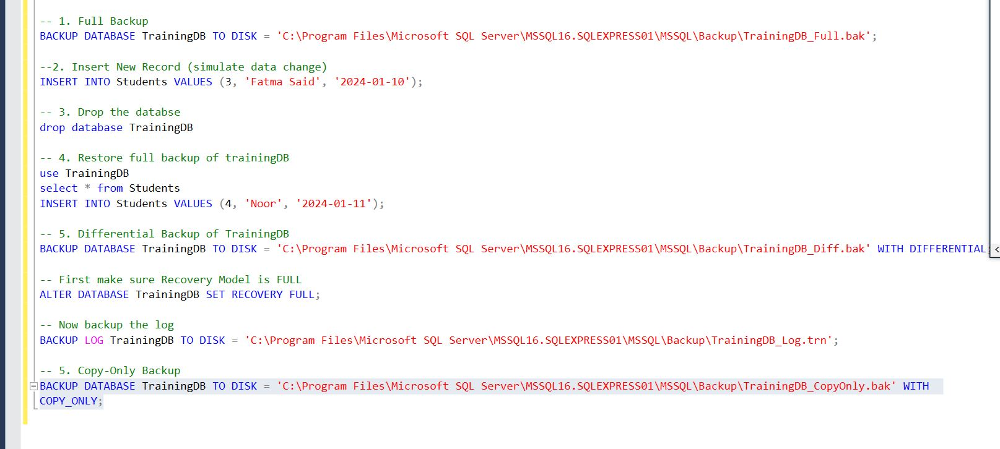
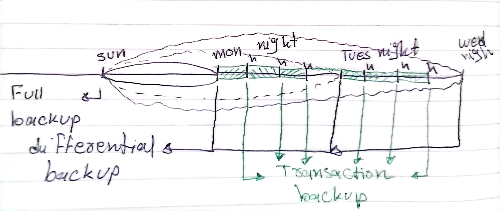

# Exploring SQL Server Backup Types
## Part 1: Research Task 
<ins>**Objective:**<ins> 
- Understand the different types of backup available in SQL Server. 


### Backup Types
1. **Full Backup**: Captures the entire database, including all data and objects.
   )
- When it is used: 
   - when a complete copy of all data is needed, offering the fastest recovery and highest data protection. It's ideal for critical systems, new system setups, major changes, and when quick data recovery is paramount.
- What it includes:
	- A full backup includes every file and folder within the system being backed up, creating a complete copy of all data. This includes files, folders, applications, and even hard drives.
- Pros & cons:
- Pros:
  - Provides a complete snapshot of the database.
  - Simplifies recovery since all data is contained in one backup file.
  - Essential for disaster recovery scenarios.
- Cons:
  - Can be time-consuming and resource-intensive, especially for large databases.
  - Requires significant storage space.
  - Not suitable for frequent backups due to performance impact.

- Real-world scenario (e.g., banking system, e-learning platform, ticketing system):
	- In a banking system, a full backup is performed weekly to ensure that all customer data, transactions, and account information are securely stored and can be restored in case of a system failure or data corruption.
	- In an e-learning platform, a full backup is taken at the end of each semester to preserve all course materials, student records, and assessment data, ensuring that the information is available for future reference or audits.
	- In a ticketing system, a full backup is conducted daily to capture all ticket sales, customer interactions, and event details, allowing for quick recovery in case of data loss or system issues.

2. **Differential Backup**: Captures only the data that has changed since the last full backup.

- When it is used:
	-Differential backups are used when a balance between storage efficiency and recovery time is needed, particularly when data changes less frequently than in an incremental approach. They are also useful for systems where a straightforward recovery process is necessary and minimizing downtime is crucial.
- What it includes:
 - A differential backup includes all files that have been added to or modified since the last full backup was performed. It's essentially a cumulative backup, meaning each subsequent differential backup includes all changes since the last full backup, not just the changes from the previous differential backup.
- Pros & cons:
- Pros:
  - Faster than full backups since only changed data is captured.
  - Requires less storage space compared to full backups.
  - Simplifies recovery by allowing restoration from the last full backup and the latest differential backup.
- Cons:
  - Recovery requires both the last full backup and the latest differential backup, which can complicate the process.
  - If multiple differential backups are taken, they can grow in size and take longer to create.
  - Not suitable for systems with frequent changes, as it may lead to larger backup sizes over time.
- Real-world scenario (e.g., banking system, e-learning platform, ticketing system):
	- In a banking system, a differential backup is performed daily after the weekly full backup to capture all transactions and account changes, ensuring that the most recent data can be quickly restored without needing to restore the entire database.
	- In an e-learning platform, a differential backup is taken every night after the full backup at the end of the semester, capturing all updates to course materials and student records, allowing for quick recovery of the latest changes without restoring the entire database.
	- In a ticketing system, a differential backup is conducted every few hours after the daily full backup, capturing all new ticket sales and customer interactions, enabling quick recovery of the latest data without the need for a full restore.

3. **Transaction Log Backup**: Captures all transactions that have occurred since the last transaction log backup.

- When it is used:
	- Transaction log backups are used for point-in-time recovery, especially after data corruption or accidental changes. They are crucial for disaster recovery and can help restore a database to a specific moment before an issue occurred.
	 
- What it includes:
	- all committed transactions and the modifications made to the database since the last transaction log backup or full database backup.
- Pros & cons:
- Pros:
	- Transaction backups capture the latest changes in the database, allowing for recovery to a point in time just before a failure or error.
	- By backing up frequently, the window of potential data loss is significantly reduced.
	- Transaction log backups help truncate the transaction log, preventing it from filling up and potentially impacting database performance.
	- Transaction log backups enable restoring the database to a specific point in time, offering greater control over recovery.
	- Transaction log backups are typically smaller than full backups, making them faster to perform.
	- The smaller size and speed allow for more frequent backups, leading to finer granularity recovery points.

- Cons:
	- Frequent backups require more time and resources, potentially impacting server performance.
	- The process of backing up transaction logs can consume server resources, potentially affecting other applications.
	- While smaller than full backups, transaction logs can still grow over time, requiring adequate storage space. 
	- For point-in-time restoration, you need a full backup as the base, and then you apply the transaction log backups.
	- If a transaction log backup fails, it can lead to data inconsistencies or issues with the restore process.
	- Managing frequent transaction log backups and their restoration can be more complex than managing full backups.
	- Frequent backups and storage can increase the overall cost of data protection. 
	
<ins>Real-world scenario (e.g., banking system, e-learning platform, ticketing system):<ins>
	- In a banking system, transaction log backups are performed every 5 minutes to ensure that all transactions, such as deposits and withdrawals, are captured, allowing for recovery to the exact moment before any issue occurred.
	- In an e-learning platform, transaction log backups are taken every 10 minutes to capture changes in student progress and course updates, enabling quick recovery of the latest data in case of accidental deletions or system failures.
	- In a ticketing system, transaction log backups are conducted every 2 minutes to ensure that all ticket sales and customer interactions are recorded, allowing for precise recovery of the system to a specific point in time if needed.

4. **Copy-Only Backup**: A special type of backup that does not affect the sequence of regular backups.

- <ins> When it is used: 
1. When you need a full backup for testing, migration, or a one-time copy without disrupting your regular backup strategy.
- <ins> When not to use copy-only backups:
1. For regular scheduled backups

-<ins> What it includes:
- All the data in the database at the point in time the backup is taken.
- <ins> Pros & cons:

	-Pros:
		- Does not interfere with the regular backup sequence, allowing for independent backups.
		- Useful for testing or creating a backup without affecting the existing backup chain.
		- Can be used for one-time backups without impacting the recovery process.
	-cons:
		- Not suitable for regular backups, as it does not maintain the backup chain.
		- Can lead to confusion if used inappropriately, as it does not contribute to the regular backup strategy.
		- Recovery from a copy-only backup may require additional steps if not planned properly.
- <ins> Real-world scenario (e.g., banking system, e-learning platform, ticketing system):
	- In a banking system, a copy-only backup is taken before a major software upgrade to ensure that the current state of the database is preserved without affecting the regular backup schedule.
	- In an e-learning platform, a copy-only backup is created before migrating to a new server, allowing for a snapshot of the database without disrupting the ongoing backup process.
	- In a ticketing system, a copy-only backup is performed before a major event to ensure that all ticket sales data is captured without interfering with the regular backup routine.

**5. File/Filegroup Backup:** Captures specific files or filegroups within a database.


- <ins>When it is used:
	
	- used to protect data by creating copies of files and folders to another location. These backups are used to recover data if it is lost, damaged, or corrupted, due to events like accidental deletion, hardware failure, or cyberattacks

- <ins> What it includes:
	- A file backup typically includes user-created and downloaded files, such as documents, spreadsheets, presentations, videos, and photos. It does not include operating system files, program files, or drivers, which are part of a system backup. 
	- File backups focus on protecting individual files or folders, making it easier to restore specific data points in case of accidental deletion or loss.

- <ins>Pros & cons:

	- Pros: 
		- Allows for selective backup and restoration of specific files or filegroups, reducing backup size and time.
		- Using file backups can increase the speed of recovery by letting you restore only damaged files, without restoring the rest of the database.
		- File backups increase flexibility in scheduling and media handling over full database backups, which for very large databases can become unmanageable. The increased flexibility of file or filegroup backups is also useful for large databases that contain data that has varying update characteristics.
	- Cons:
		- Requires careful management to ensure all necessary files are backed up.
		- Recovery can be more complex if multiple files or filegroups are involved.
		- Not suitable for complete database recovery, as it only captures specific parts of the database.

-<ins> Real-world scenario (e.g., banking system, e-learning platform, ticketing system):

- In a banking system, a file backup is performed for specific account-related files to ensure that critical data can be restored quickly without needing to restore the entire database.
- In an e-learning platform, file backups are taken for course materials and student submissions, allowing for quick recovery of specific files in case of accidental deletions or corruption.
- In a ticketing system, file backups are conducted for event-related documents and customer interactions, enabling quick restoration of specific files without affecting the entire ticketing database.


### Summary
In SQL Server, various backup types serve different purposes and scenarios. Full backups provide a complete snapshot of the database, while differential backups capture changes since the last full backup. Transaction log backups allow for point-in-time recovery, and copy-only backups are useful for one-time backups without disrupting the regular backup sequence. File/filegroup backups enable selective backup and restoration of specific parts of the database. Each type has its pros and cons, making it essential to choose the right backup strategy based on the system's requirements and data protection needs.

<ins> Table of Backup Types:
| Backup Type          | When to Use                                                                 | What it Includes                                           | Pros                                                                 | Cons                                                                 | Real-World Scenario Examples                                                                 |
|----------------------|-----------------------------------------------------------------------------|------------------------------------------------------------|----------------------------------------------------------------------|----------------------------------------------------------------------|-----------------------------------------------------------------------------------------------|
| Full Backup          | When a complete copy of all data is needed                                  | Entire database, all data and objects                       | Complete snapshot, simplifies recovery, essential for disaster recovery | Time-consuming, requires significant storage space, not suitable for frequent backups | Banking system: weekly full backup; e-learning platform: end-of-semester backup; ticketing system: daily backup |
| Differential Backup  | When a balance between storage efficiency and recovery time is needed       | Data changed since the last full backup                     | Faster than full backups, requires less storage, simplifies recovery | Requires both last full and latest differential backup for recovery, can grow in size over time | Banking system: daily differential backup; e-learning platform: nightly backup; ticketing system: every few hours |
| Transaction Log Backup | For point-in-time recovery, especially after data corruption or accidental changes | All transactions since the last transaction log backup      | Allows recovery to a specific moment, reduces potential data loss   | Requires full backup as base, can complicate restoration process     | Banking system: every 5 minutes; e-learning platform: every 10 minutes; ticketing system: every 2 minutes |
| Copy-Only Backup     | For testing, migration, or one-time copy without disrupting regular backups | All data in the database at the point in time of backup     | Does not interfere with regular backups, useful for one-time backups | Not suitable for regular backups, can lead to confusion if misused   | Banking system: before software upgrade; e-learning platform: before server migration; ticketing system: before major event |
| File/Filegroup Backup | To protect specific files or filegroups within a database                | Specific files or filegroups within the database            | Selective backup and restoration, reduces backup size and time      | Requires careful management, recovery can be complex                 | Banking system: specific account-related files; e-learning platform: course materials; ticketing system: event-related documents |

## Part 2: Perform Backup Operations in sql server
### Backup Operations
1. **Full Backup**:
   ```sql
   BACKUP DATABASE YourDatabaseName
   TO DISK = 'C:\Backups\YourDatabaseName_Full.bak'
   WITH FORMAT, INIT, SKIP, NOREWIND, NOUNLOAD, STATS = 10;
   ```
	Explaination :
   - `YourDatabaseName`: Replace with the name of your database.
   - `DISK = 'C:\Backups\YourDatabaseName_Full.bak'`: Specify the path where the backup file will be stored.
   - `WITH FORMAT, INIT, SKIP, NOREWIND, NOUNLOAD, STATS = 10`: These options control how the backup is performed:
	 - `FORMAT`: Creates a new media set.
	 - `INIT`: Overwrites existing backup files.
	 - `SKIP`: Skips checks for existing media sets.
	 - `NOREWIND`: Does not rewind the tape after the backup.
	 - `NOUNLOAD`: Does not unload the tape after the backup.
	 - `STATS = 10`: Displays progress information every 10 percent.
2. **Differential Backup**:
   ```sql
   BACKUP DATABASE YourDatabaseName
   TO DISK = 'C:\Backups\YourDatabaseName_Diff.bak'
   WITH DIFFERENTIAL, FORMAT, INIT, SKIP, NOREWIND, NOUNLOAD, STATS = 10;
   ```
	Explaination :
	   - `DIFFERENTIAL`: Specifies that this is a differential backup, capturing only changes since the last full backup.
	   - The other options are similar to those used in the full backup command.

3. **Transaction Log Backup**:
   ```sql
   BACKUP LOG YourDatabaseName
   TO DISK = 'C:\Backups\YourDatabaseName_Log.trn'
   WITH FORMAT, INIT, SKIP, NOREWIND, NOUNLOAD, STATS = 10;
   ```
	Explaination :
   - `LOG`: Specifies that this is a transaction log backup.
   - `YourDatabaseName`: Replace with the name of your database.
   - `DISK = 'C:\Backups\YourDatabaseName_Log.trn'`: Specify the path where the transaction log backup file will be stored.
   - The other options are similar to those used in the full backup command.
	
4. **Copy-Only Backup**:
   ```sql
   BACKUP DATABASE YourDatabaseName
   TO DISK = 'C:\Backups\YourDatabaseName_CopyOnly.bak'
   WITH COPY_ONLY, FORMAT, INIT, SKIP, NOREWIND, NOUNLOAD, STATS = 10;
   ```
	Explaination :
   - `COPY_ONLY`: Specifies that this is a copy-only backup, which does not affect the regular backup sequence.
   - The other options are similar to those used in the full backup command.
	
5. **File/Filegroup Backup**:
   ```sql
   BACKUP DATABASE YourDatabaseName
   FILEGROUP = 'YourFileGroupName'
   TO DISK = 'C:\Backups\YourDatabaseName_FileGroup.bak'
   WITH FORMAT, INIT, SKIP, NOREWIND, NOUNLOAD, STATS = 10;
   ```
	Explaination :
   - `FILEGROUP = 'YourFileGroupName'`: Replace with the name of the filegroup you want to back up.
   - `DISK = 'C:\Backups\YourDatabaseName_FileGroup.bak'`: Specify the path where the filegroup backup file will be stored.
   - The other options are similar to those used in the full backup command.

real -world scenario example for each backup type:



## Part 3: Real-World Scenario Simulation 
Scenario: 
You are a database admin for a hospital system. 
On Sunday you take a full backup. Each night, you take a differential backup. Every hour, you 
back up the transaction log. 
Challenge Task: 
Design a backup schedule for this hospital system using SQL scripts. Assume the database is 
called HospitalDB. Include: 
• Backup frequency 
• Type of backup for each day/time 
• Folder naming and file versioning convention 
Deliverable: 
A .sql file or script plan + brief description of the strategy
### Backup Schedule for Hospital System Database (HospitalDB)
```sql
-- Full Backup on Sunday
BACKUP DATABASE HospitalDB
TO DISK = 'C:\Backups\HospitalDB_Full_' + CONVERT(VARCHAR(20), GETDATE(), 112) + '.bak'
WITH FORMAT, INIT, SKIP, NOREWIND, NOUNLOAD, STATS = 10;
-- Differential Backup every night (Monday to Saturday)
DECLARE @currentDate VARCHAR(20) = CONVERT(VARCHAR(20), GETDATE(), 112);
BACKUP DATABASE HospitalDB
TO DISK = 'C:\Backups\HospitalDB_Diff_' + @currentDate + '.bak'
WITH DIFFERENTIAL, FORMAT, INIT, SKIP, NOREWIND, NOUNLOAD, STATS = 10;
-- Transaction Log Backup every hour
DECLARE @currentTime VARCHAR(20) = CONVERT(VARCHAR(20), GETDATE(), 108);
BACKUP LOG HospitalDB
TO DISK = 'C:\Backups\HospitalDB_Log_' + @currentDate + '_' + @currentTime + '.trn'
WITH FORMAT, INIT, SKIP, NOREWIND, NOUNLOAD, STATS = 10;
```
### Explanation of the Backup Schedule
- **Full Backup**: 
  - Performed every Sunday to capture the entire database state.
  - The backup file is named with the date of the backup for easy identification (e.g., `HospitalDB_Full_20231001.bak`).
- **Differential Backup**: 
  - Performed every night from Monday to Saturday to capture changes since the last full backup.
  - The backup file is named with the date of the backup (e.g., `HospitalDB_Diff_20231001.bak`).
- **Transaction Log Backup**: 
  - Performed every hour to capture all transactions that have occurred since the last transaction log backup.
  - The backup file is named with the date and time of the backup for precise tracking (e.g., `HospitalDB_Log_20231001_120000.trn`).

### Plane Description

#### Reference
['SQL Server Differential Backup'](https://sqlbak.com/blog/sql-server-differential-backup-fast-guide/)
['SQL Server Transaction Log Backup'](https://www.sqlshack.com/sql-server-transaction-log-backup/)
['SQL Server Copy-Only Backup'](https://www.sqlshack.com/sql-server-copy-only-backup/)
['SQL Server File/Filegroup Backup'](https://www.sqlshack.com/sql-server-file-filegroup-backup/)
['File Backup'](https://learn.microsoft.com/en-us/sql/relational-databases/backup-restore/full-file-backups-sql-server?view=sql-server-ver17)
['Backup'](https://learn.microsoft.com/en-us/sql/t-sql/statements/backup-transact-sql?view=sql-server-ver17)
